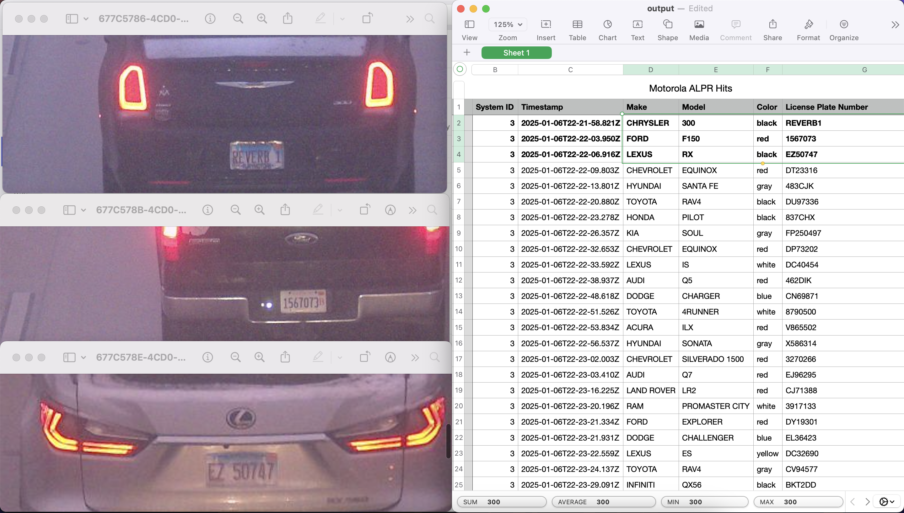

# ALPR Leaks



Log license plates, vehicle make, vehicle color, and vehicle model to a CSV along with a JPEG image of the vehicle from Motorola ALPRs exposed to the public internet.

This script is preloaded with 3 IP addresses from Chicago, but more can be added. See [motorola-ip-addresses.json](./motorola-ip-addresses.json) for a list of over 100 IP addresses found through [Shodan](https://shodan.io).

Research credit to [Matt Brown](https://www.youtube.com/@mattbrwn). For more info, watch his [YouTube video](https://youtu.be/0dUnY1641WM?si=A2geeOF-FCunDW-v) reporting this vulnerability.

### Disclaimer

This script is for educational purposes only. Do not use this script in any way that violates the law. Only use this script on devices you own or have permission to use it on.

This script was thrown together in a short period of time with a lot of assistance from GitHub Copilot. It is not perfect and may not work as expected. Feel free to fix and bugs you find and open a pull request.

## Running Locally

To run this project locally, follow these steps:

### Prerequisites

Make sure you have the following installed on your machine:
- [Node.js](https://nodejs.org/) (version 14 or higher)
- [npm](https://www.npmjs.com/) (version 6 or higher)

### Installation

1. Clone the repository:
  ```sh
  git clone https://github.com/frillweeman/alprleaks.git
  ```
2. Navigate to the project directory:
  ```sh
  cd alprleaks
  ```
3. Install the dependencies:
  ```sh
  npm install
  ```

### Setup

1. Change the list of IP addresses in [index.ts](./src/index.ts) to the IP addresses you want to monitor. Use [motorola-ip-addresses.json](./motorola-ip-addresses.json) for a list of over 100 IP addresses found through [Shodan](https://shodan.io).

### Running the Project

1. Compile the TypeScript files:
  ```sh
  npm run build
  ```
2. Start the application:
  ```sh
  npm start
  ```
